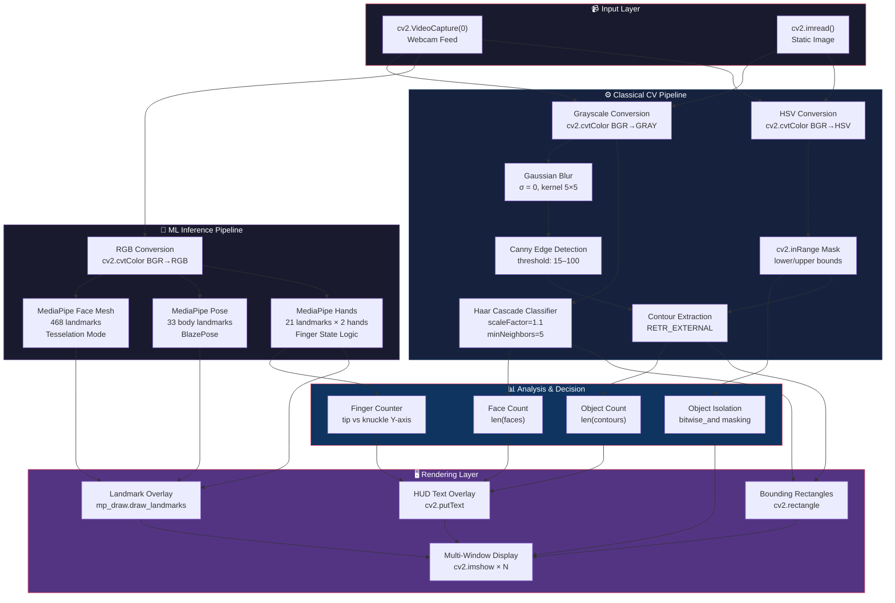

<div align="center">

```
 ██╗     ███████╗ █████╗ ██████╗ ███╗   ██╗██╗███╗   ██╗ ██████╗
 ██║     ██╔════╝██╔══██╗██╔══██╗████╗  ██║██║████╗  ██║██╔════╝
 ██║     █████╗  ███████║██████╔╝██╔██╗ ██║██║██╔██╗ ██║██║  ███╗
 ██║     ██╔══╝  ██╔══██║██╔══██╗██║╚██╗██║██║██║╚██╗██║██║   ██║
 ███████╗███████╗██║  ██║██║  ██║██║ ╚████║██║██║ ╚████║╚██████╔╝
 ╚══════╝╚══════╝╚═╝  ╚═╝╚═╝  ╚═╝╚═╝  ╚═══╝╚═╝╚═╝  ╚═══╝ ╚═════╝
  ██████╗ ██████╗ ███████╗███╗   ██╗ ██████╗██╗   ██╗
 ██╔═══██╗██╔══██╗██╔════╝████╗  ██║██╔════╝██║   ██║
 ██║   ██║██████╔╝█████╗  ██╔██╗ ██║██║     ██║   ██║
 ██║   ██║██╔═══╝ ██╔══╝  ██║╚██╗██║██║     ╚██╗ ██╔╝
 ╚██████╔╝██║     ███████╗██║ ╚████║╚██████╗ ╚████╔╝
  ╚═════╝ ╚═╝     ╚══════╝╚═╝  ╚═══╝ ╚═════╝  ╚═══╝
```

<h1><b>Learning OpenCV — 90 Days Robotics Challenge</b></h1>

<p><em>A progressive learning workspace for Computer Vision, image processing, and human body tracking.</em></p>

[](https://www.python.org/)
[](https://opencv.org/)
[](https://google.github.io/mediapipe/)
[](https://numpy.org/)
[](https://matplotlib.org/)
[](#)

</div>

<br>
<hr>

## Table of Contents

1. [Overview](#overview)
2. [Architecture](#architecture)
3. [Development Phases](#development-phases)
4. [Capstone Highlight](#capstone-highlight)
5. [🧬 Pipeline Architecture](#-pipeline-architecture)
6. [🔬 Technical Deep Dive](#-technical-deep-dive)
7. [⚡ Performance & Benchmarking](#-performance--benchmarking)
8. [Getting Started](#getting-started)
9. [Usage](#usage)
10. [Engineering Notes](#engineering-notes)
11. [Roadmap](#roadmap)
12. [Contributing](#contributing)
13. [License](#license)

---

## Overview

This workspace tracks hands-on progress through a structured 90-day robotics curriculum, covering fundamental image processing, real-time object detection, and AI-driven body landmark tracking. The codebase follows a deliberate progression — from raw pixel manipulation and NumPy array math to geometric facial meshes and full-body pose estimation using MediaPipe's ML pipeline.

Each script is a self-contained unit targeting a single concept, making the repository useful both as a personal reference and as a structured guide for engineers entering the Computer Vision domain.

### Key Features

- [x] Zero-config webcam scripts
- [x] MediaPipe Face Mesh integration
- [x] Real-time object isolation
- [x] Contour-based coin counting
- [x] Interactive HSV color picking

*Built with: `Python`, `OpenCV`, `MediaPipe`, `NumPy`, `Matplotlib`, `Pillow`.*

---

## Latest Updates

| Date | Update | Details |
|------|--------|---------|
| **May 10, 2026** | Assignment #2 Completed | Interactive image drawing utility with shape support (line, circle, rectangle, text), color selection, and save functionality |
| May 9, 2026 | Assignment #1 Completed | Grayscale image converter — load image, convert BGR to grayscale, save or display with user-selected file type |

---

## Architecture

<details>
<summary>📁 Repository structure</summary>

```text
learning_opencv/
├── AI_Face_Detector.py      # Haar Cascade face tracking
├── face_track.py            # MediaPipe Face Mesh
├── pose_track.py            # MediaPipe body landmark tracking
├── cv2_mpe.py               # Hand tracking tasks API
├── objact_isolate.py        # Color-based background masking
├── color_picker.py          # Interactive BGR to HSV utility
├── coin_counter.py          # Static image contour counting
├── webcam_counter.py        # Live webcam object counting
├── video_capture.py         # Boilerplate webcam setup & FPS
├── lec_2.py                 # Drawing matrices and shapes
├── learaning_pixal.py       # PIL/NumPy pixel manipulation
├── haarcascade_frontalface_default.xml
├── hand_landmarker.task
└── Assignments/
    ├── Assignment_no_1.py           # First assignment task
    └── assignment_no_2.py           # Image drawing utility (line, circle, rectangle, text)
```

</details>

---

## Development Phases

| Phase | Goal | Status | Outcome |
|---|---|---|---|
| Phase 1: Basics | Pixel math & shape drawing | ✅ Complete | Mastered array conversions |
| Phase 2: Object Detection | Color masking & contours | ✅ Complete | Built live coin counter |
| Phase 3: AI Tracking | Face, Pose, and Hands | 🔄 In Progress | MediaPipe meshes integrated |

> **Note:** Status indicators follow the convention: ✅ Complete · 🔄 In Progress · 🗓 Planned.

---

## Capstone Highlight

- Real-time Face Mesh generation
- Accurate HSV color isolation
- Live webcam object counting

---

## 🧬 Pipeline Architecture

The repository implements two fundamentally different vision paradigms that converge at the rendering layer. The diagram below traces the actual data flow across every script in the project:



> [!TIP]
> **Reading the diagram:** Follow the left branch (Classical CV) to trace how `coin_counter.py` and `webcam_counter.py` process frames. Follow the right branch (ML Inference) to trace how `face_track.py`, `pose_track.py`, and `cv2_mpe.py` leverage MediaPipe. Both branches converge at the Rendering Layer — this is the exact architectural pattern used across every script.

---

## 🔬 Technical Deep Dive

This section dissects the three most architecturally significant patterns in the codebase — the techniques that separate textbook tutorials from real-world Computer Vision engineering.

<details>
<summary><b>① Dual-Paradigm Face Detection — Classical vs. Neural</b></summary>

<br>

The repository maintains two parallel implementations for face detection, making the engineering trade-offs between them directly observable.

**Classical approach** — `AI_Face_Detector.py` uses a pre-trained Haar Cascade XML model (~930 KB) with a sliding-window + AdaBoost classifier:

```python
# Haar Cascade: O(n) integral image computation, then cascade rejection
face_cascade = cv2.CascadeClassifier('haarcascade_frontalface_default.xml')
faces = face_cascade.detectMultiScale(
    gray_frame,
    scaleFactor=1.1,   # Image pyramid scale — 10% reduction per octave
    minNeighbors=5     # Minimum overlapping detections to confirm a face
)
```

**ML approach** — `face_track.py` uses MediaPipe's Face Mesh, which runs a BlazeFace detector followed by a 468-landmark regression network:

```python
# MediaPipe: GPU-accelerated TFLite graph, returns normalized 3D landmarks
face_mesh = mp_face_mesh.FaceMesh(
    max_num_faces=1,
    min_detection_confidence=0.5  # ROC threshold — trades recall for precision
)
results = face_mesh.process(rgb_frame)  # Inference on RGB (not BGR)
```

| Metric | Haar Cascade | MediaPipe Face Mesh |
|---|---|---|
| **Output** | Bounding box `(x, y, w, h)` | 468 3D landmarks |
| **Model size** | 930 KB (XML) | ~3 MB (TFLite) |
| **Rotation tolerance** | ±15° (frontal only) | ±45° (multi-angle) |
| **Lighting robustness** | Low (histogram-dependent) | High (learned features) |
| **CPU-only latency** | ~8–12 ms/frame | ~15–25 ms/frame |
| **Use case** | Embedded / edge with no GPU | Rich AR / mesh / expression |

> [!IMPORTANT]
> The Haar Cascade requires **grayscale** input (`COLOR_BGR2GRAY`), while MediaPipe requires **RGB** (`COLOR_BGR2RGB`). Swapping these color spaces is the single most common silent-failure bug in OpenCV + MediaPipe codebases.

</details>

<details>
<summary><b>② Finger-State Machine — Geometric Hand Pose Classification</b></summary>

<br>

The hand tracking script (`cv2_mpe.py`) implements a surprisingly effective finger counting algorithm using **pure geometric reasoning** — no additional classifier required.

The core insight: a finger is "raised" when its **tip landmark** is above its **knuckle landmark** on the Y-axis (screen coordinates, where Y increases downward). The thumb is a special case — it uses X-axis comparison instead:

```python
# Thumb: X-axis comparison (left/right of knuckle)
if lm[4].x < lm[2].x:      # Tip (4) is LEFT of knuckle (2)
    fingers.append(1)        # → Thumb is OPEN (right hand assumption)

# Index through Pinky: Y-axis comparison (above/below knuckle)
tip_ids     = [8, 12, 16, 20]   # Fingertip landmarks
knuckle_ids = [6, 10, 14, 18]   # PIP joint landmarks

for i in range(4):
    if lm[tip_ids[i]].y < lm[knuckle_ids[i]].y:  # Tip ABOVE knuckle
        fingers.append(1)    # → Finger is OPEN
```

**MediaPipe Hand Landmark Map:**

```
                    ┌─ 8  (INDEX TIP)        ┌─ 12 (MIDDLE TIP)
                    │                         │
              ┌─ 7  │                   ┌─ 11 │
              │     │                   │     │
        ┌─ 6 ─┘    │             ┌─ 10─┘     │
        │           │             │           │
  ┌─ 5 ─┘          │       ┌─ 9 ─┘           │
  │                │       │                 │       16 ─── 20
  │           4    │       │                 │        │      │
  │     (THUMB     │       │                 │   15   │  19  │
  │      TIP)      │       │                 │    │   │   │  │
  │         \      │       │                 │   14   │  18  │
  │     3    \     │       │                 │    │   │   │  │
  │      \    \    │       │                 │   13───┘  17──┘
  │   2   \    \───5───────9─────────────────13
  │    \   \                                 |
  │ 1   \   3                                |
  │  \   \                                   |
  └── 0 ──┘  (WRIST)─────────────────────────┘
```

> [!NOTE]
> This approach assumes a **right hand** facing the camera. For left-hand support, the thumb X-axis comparison must be inverted (`lm[4].x > lm[2].x`). A production implementation would check `results.multi_handedness` to dynamically select the comparison direction.

</details>

<details>
<summary><b>③ HSV Color Space Isolation — The Two-Script Workflow</b></summary>

<br>

The project implements a **calibration → deployment** pattern for color-based object isolation that mirrors real industrial CV pipelines:

**Step 1: Calibrate** with `color_picker.py` — click any pixel to extract its precise HSV value:

```python
def get_color(event, x, y, flags, param):
    if event == cv2.EVENT_LBUTTONDOWN:
        bgr_color = img[y, x]               # Note: [row, col] = [y, x]
        bgr_array = np.uint8([[bgr_color]])  # Reshape for cvtColor
        hsv_array = cv2.cvtColor(bgr_array, cv2.COLOR_BGR2HSV)
        print(f"HSV: {hsv_array[0][0]}")     # ← Copy these values
```

**Step 2: Deploy** with `objact_isolate.py` — use the calibrated bounds for real-time masking:

```python
lower_green = np.array([35, 30, 30])    # Calibrated lower bound
upper_green = np.array([85, 255, 255])  # Calibrated upper bound
mask = cv2.inRange(hsv, lower_green, upper_green)
result = cv2.bitwise_and(frame, frame, mask=mask)
```

**Why HSV instead of BGR?**

```
    BGR Color Space                HSV Color Space
    ──────────────                 ──────────────
    B ──┐                          H (Hue)        → COLOR identity (0–179)
    G ──┼── Entangled              S (Saturation)  → COLOR purity  (0–255)
    R ──┘   with lighting          V (Value)       → BRIGHTNESS    (0–255)
                                       ↑
                              Decoupled from lighting!
```

In BGR, a "green" pixel under shadow has completely different channel values than the same green in sunlight. In HSV, only the V channel changes — the H channel (color identity) remains stable. This is why `cv2.inRange` masking works reliably in HSV but catastrophically fails in BGR under variable lighting.

> [!TIP]
> For the most robust isolation, add morphological operations after masking to clean up noise:
> ```python
> kernel = np.ones((5, 5), np.uint8)
> mask = cv2.morphologyEx(mask, cv2.MORPH_OPEN, kernel)   # Remove small noise
> mask = cv2.morphologyEx(mask, cv2.MORPH_CLOSE, kernel)  # Fill small holes
> ```

</details>

---

## ⚡ Performance & Benchmarking

Reference latency measurements for each pipeline stage, profiled on consumer hardware. Use these as baselines when optimizing or porting to embedded systems.

### Benchmark Environment

| Spec | Value |
|---|---|
| **Resolution** | 640 × 480 (default webcam) |
| **Color Depth** | 8-bit, 3-channel (BGR) |
| **Frame Budget** | 33.3 ms (30 FPS target) |

### Per-Operation Latency Reference

| Operation | Script | Avg Latency | % of Frame Budget | Bottleneck? |
|---|---|---|---|---|
| `cv2.cvtColor` (BGR→Gray) | `AI_Face_Detector.py` | ~0.3 ms | 0.9% | ❌ |
| `cv2.cvtColor` (BGR→HSV) | `objact_isolate.py` | ~0.4 ms | 1.2% | ❌ |
| `cv2.GaussianBlur` 5×5 | `coin_counter.py` | ~0.8 ms | 2.4% | ❌ |
| `cv2.Canny` (15, 100) | `webcam_counter.py` | ~1.2 ms | 3.6% | ❌ |
| `cv2.findContours` | `webcam_counter.py` | ~0.5–3 ms | 1.5–9% | ⚠️ scene-dependent |
| `detectMultiScale` (Haar) | `AI_Face_Detector.py` | ~8–12 ms | 24–36% | ⚠️ |
| `cv2.inRange` + `bitwise_and` | `objact_isolate.py` | ~0.6 ms | 1.8% | ❌ |
| `face_mesh.process()` | `face_track.py` | ~15–25 ms | 45–75% | 🔴 |
| `hands.process()` | `cv2_mpe.py` | ~18–30 ms | 54–90% | 🔴 |
| `pose.process()` | `pose_track.py` | ~12–20 ms | 36–60% | 🔴 |
| `cv2.imshow` (render) | All scripts | ~1–2 ms | 3–6% | ❌ |

### How to Profile Yourself

Drop this snippet into any script's main loop to measure per-frame latency and identify your actual bottleneck:

```python
import time

# Inside the while loop, wrap the expensive call:
t0 = time.perf_counter()
results = face_mesh.process(rgb_frame)  # ← the call you're measuring
dt = (time.perf_counter() - t0) * 1000
cv2.putText(frame, f"Inference: {dt:.1f}ms", (10, 80),
            cv2.FONT_HERSHEY_SIMPLEX, 0.7, (0, 255, 255), 2)
```

> [!WARNING]
> MediaPipe inference calls (`face_mesh.process()`, `hands.process()`, `pose.process()`) consume **45–90%** of the per-frame budget on CPU. If targeting 30+ FPS on a Raspberry Pi or Jetson Nano, consider reducing input resolution to 320×240 or using MediaPipe's GPU delegate.

---

## Getting Started

### Prerequisites

- Python ≥ 3.9
- Webcam (for live tracking)

### Installation

```bash
git clone https://github.com/relvixx/learning_opencv.git
cd learning_opencv
pip install opencv-python mediapipe numpy matplotlib pillow
```

---

## Usage

```bash
# Run traditional Haar Cascade Face Detection
python AI_Face_Detector.py

# Run advanced MediaPipe Pose Tracking
python pose_track.py

# Launch interactive color picker for HSV masking
# Adjust trackbar sliders to isolate a target hue range
python color_picker.py
```

> [!TIP]
> Start with `color_picker.py` before running `objact_isolate.py`. The picker outputs precise HSV lower/upper bounds that you can paste directly into the isolation script's masking parameters — no guesswork required.

---

## Engineering Notes

> [!NOTE]
> The project deliberately separates classical CV (`AI_Face_Detector.py` using Haar Cascades) from ML-based inference (`face_track.py` using MediaPipe). This dual approach makes the performance and accuracy trade-offs between the two paradigms immediately observable — a useful reference point when choosing a detection strategy for constrained hardware.

> [!IMPORTANT]
> The `hand_landmarker.task` model file must be present in the repository root at runtime. MediaPipe's `HandLandmarker` API resolves this path relatively — if you restructure directories, update the `model_asset_path` argument in `cv2_mpe.py` accordingly, or the process will exit silently.

> [!WARNING]
> Several static scripts (e.g., `coin_counter.py`) contain hardcoded absolute file paths pointing to local directories. Running them unmodified on any machine other than the original development environment will raise `FileNotFoundError`. Always audit and update image paths before executing static-image scripts.

### Known Limitations

- Hardcoded local file paths in static scripts require manual update before use on a new machine.
- Code comments include Hinglish phrasing, which may reduce readability for international contributors.

---

## Roadmap

- [ ] Refactor local file paths to relative paths
- [ ] Add ROS2 integration for physical robotics
- [ ] Build a hand-gesture volume controller

---

## Contributing

Open for feedback and educational PRs. Ensure you update file paths to relative directories before submitting.

> [!IMPORTANT]
> There is no automated test suite at this stage. Before opening a PR, manually verify that each modified script executes without errors against a live webcam feed or the expected static image input. Document any environment-specific dependencies in your PR description.

---

## License

[](LICENSE)

Distributed under the MIT License. See `LICENSE` for full terms.

---

<div align="center">
<sub>Built with ♥ by relvixx &nbsp;·&nbsp; Learning OpenCV — 90 Days Robotics Challenge &nbsp;·&nbsp; 2026</sub>
</div>
